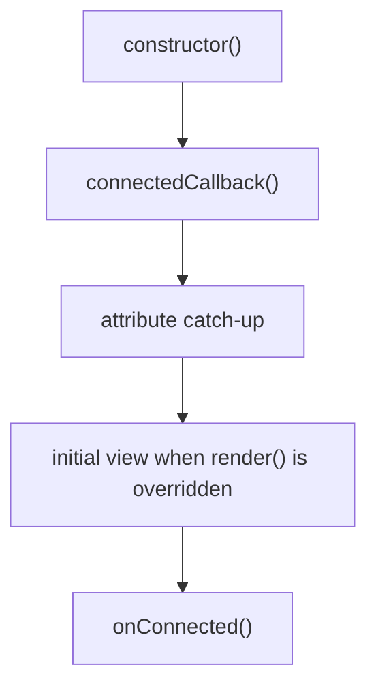
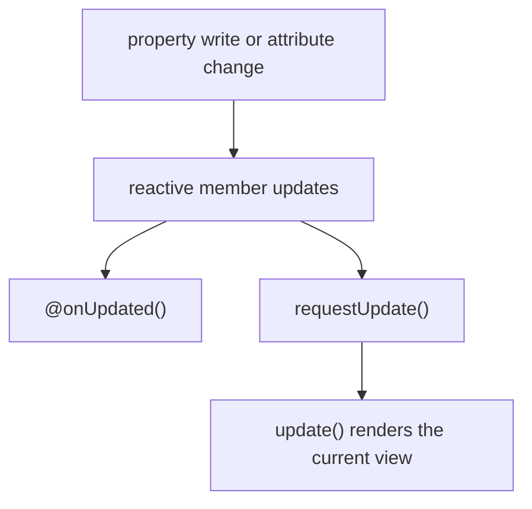
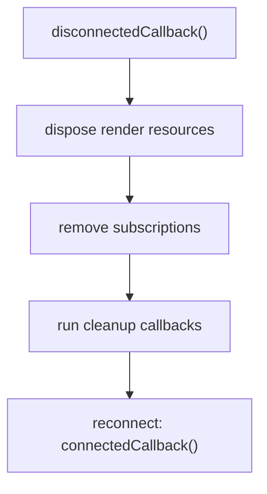

# Lifecycle

This page describes the client lifecycle of a `RadiantElement`. Radiant follows the browser's custom-element lifecycle and adds a reactive connection cycle. The useful distinction is timing: `registerConnectedCallback()` runs synchronously at the start of `connectedCallback()`, while `onConnected()` runs after first-connect attribute catch-up and the initial render or hydration work.

## Connection sequence

This is the normal connection path, not every internal branch. A host that does not override `render()` keeps its authored light DOM instead of entering the initial-view step. On reconnect, `onConnected()` runs again after Radiant restores the host's reactive connection. `registerConnectedCallback()` is intentionally not shown as a separate application step: it is an early, low-level hook inside `connectedCallback()`.

## Reactive updates

Connection is only the first pass. After a host is connected, a property or observed attribute can trigger both an imperative `@onUpdated()` callback and, for render-owning hosts, a scheduled `update()`:

The two branches are independent. Use `@onUpdated()` for an imperative side effect; use JSX bindings and the render scheduler for DOM your host owns. A plain `RadiantElement` that keeps authored children does not enter the render branch unless it overrides `render()`. During first-connect `@prop` synchronization, `@onUpdated()` can run before `onConnected()`.

## Disconnect and reconnect

Disconnect tears down connection-scoped resources. The same instance can later reconnect:

## What each hook is for

| Hook or API | Runs | Use it for |
| --- | --- | --- |
| `constructor()` | During element construction | Initialize instance fields. Do not assume authored attributes or child DOM are available. |
| `connectedCallback()` | When the browser connects the element | Synchronous native setup that must begin immediately, such as installing event listeners or a `MutationObserver`. Call `super.connectedCallback()` first when overriding it. |
| `registerConnectedCallback()` | Synchronously from `connectedCallback()`, on each connection | Low-level decorator and host-integration plumbing. It runs before attribute catch-up, so application code should not use it when it needs final property values. |
| `attributeChangedCallback()` | When an observed attribute changes after the host is ready | Radiant's internal attribute-to-property bridge. Most components should not override it; authored first-connect attributes are replayed during the connection microtask. |
| `onConnected()` | In the connection microtask, after catch-up and initial render or hydration | Post-sync setup that needs reactive properties or rendered `data-ref` elements. It runs again after reconnect. |
| `@onUpdated(...)` | When the named reactive property changes, including the initial `@prop` sync | Synchronize imperative DOM, storage, analytics, or other external state with a property. |
| `requestUpdate()` / `update()` | For render-owning hosts | Schedule or immediately flush a JSX view update. Most components should let reactive JSX bindings schedule this automatically. |
| `disconnectedCallback()` | When the browser disconnects the element | Tear down resources owned by the connection and call `super.disconnectedCallback()`. |
| `registerCleanupCallback()` | Registered during setup; invoked during disconnect | Register cleanup for decorator or host integrations that use the lower-level reactive-host API. |
| `adoptedCallback()` | When the browser moves an element to another document | An advanced native custom-element hook; Radiant does not add behavior here. |

## First connection and attribute catch-up

The browser or JSX can set attributes before a custom element has connected. Radiant intentionally defers the first property synchronization until its connection microtask:

1. The browser calls `connectedCallback()`.
2. Radiant runs registered connection callbacks immediately.
3. Radiant queues the connection work and catches up authored attributes.
4. If `render()` is overridden, Radiant hydrates or renders the initial view; otherwise it keeps the authored light DOM.
5. Radiant calls `onConnected()`.

This ordering prevents a constructor default from overwriting an authored attribute and gives `onConnected()` a stable point for post-sync work. If the host is removed before the microtask runs, Radiant aborts the pending work and does not call `onConnected()`.

## Choosing the right hook

Use the smallest lifecycle surface that matches the job:

- Render your own UI with JSX bindings. Do not query a node only to copy a reactive value into it.
- Use `@onUpdated('property')` when an imperative side effect must follow property changes.
- Use `onConnected()` when setup needs the final initial property values or the initial rendered view, and repeat that setup after reconnect.
- Use `@query(...)` only when that setup needs a live element handle—for example, to focus an element, observe it, or pass it to an imperative browser API.
- Put connection-scoped teardown in `disconnectedCallback()` and always call `super.disconnectedCallback()`.

## Related documentation

- [RadiantElement](/docs/components/radiant-element) for host modes and render ownership
- [RadiantController](/docs/components/radiant-controller) for attaching the same reactive model to existing HTML
- [Slots](/docs/components/slots) for authored light-DOM projection
- [Hydration](/docs/ssr/hydration) for server-rendered host behavior
