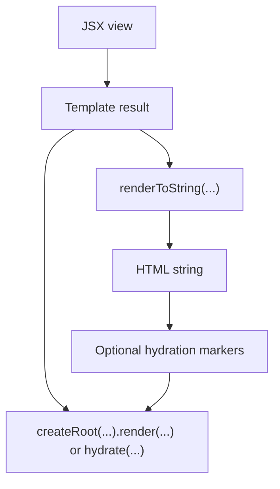
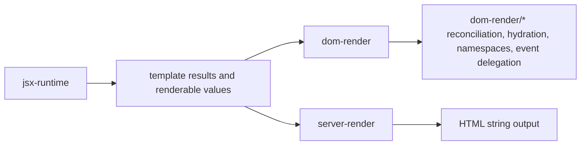
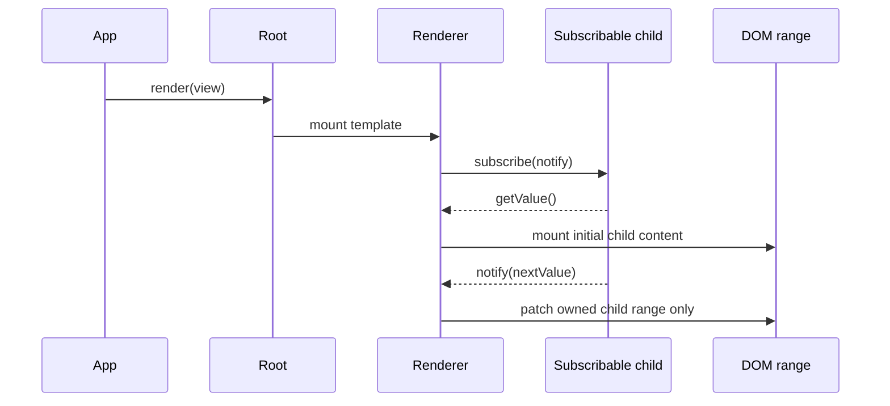
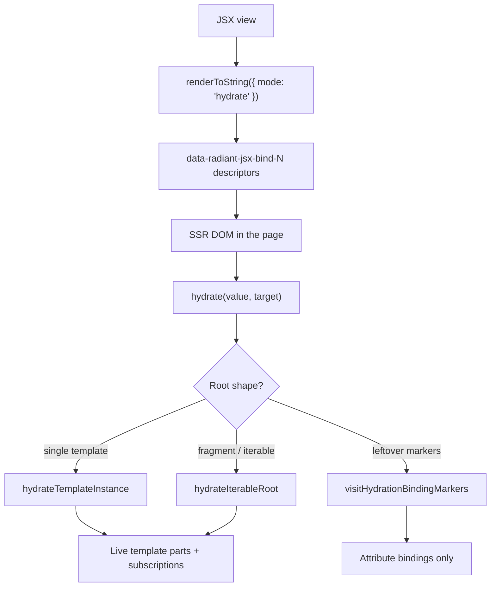

# Radiant JSX

Radiant JSX is the JSX authoring layer for the Radiant ecosystem.

Use `@ecopages/jsx` when you want TSX syntax, intrinsic element typing, SSR serialization, hydration support, and direct DOM mounting. Keep using `@ecopages/radiant` when you need component classes, decorators, lifecycle, and reactive host state.

[](https://www.npmjs.com/package/@ecopages/jsx)
[](https://github.com/ecopages/radiant/blob/main/packages/jsx/LICENSE)

## Start Here

The shortest accurate mental model is:

1. JSX produces a renderer-neutral template result.
2. The same template result can go to the DOM renderer or the SSR renderer.
3. Fine-grained updates happen at bound child ranges, not through a hook scheduler.

The package surface is intentionally split by use case:

- `@ecopages/jsx` is the full authoring surface. Use it when a file needs both JSX primitives and rendering helpers.
- `@ecopages/jsx/client` is the browser mounting surface. Use it when code should stay client-only.
- `@ecopages/jsx/server` is the SSR surface. Use it when code should stay server-only.
- `@ecopages/jsx/jsx-runtime` and `@ecopages/jsx/jsx-dev-runtime` are the automatic runtime entry points used by TypeScript and bundlers.

## What This Package Does

`@ecopages/jsx` provides:

- automatic JSX runtime entry points through `@ecopages/jsx/jsx-runtime` and `@ecopages/jsx/jsx-dev-runtime`
- typed intrinsic HTML and SVG elements
- plain function components and fragments
- primary DOM event bindings with `on:*`
- explicit native escape-hatch bindings with `on-native:*`
- explicit property bindings with `prop:*`
- boolean, `data`, `aria`, `class`, `className`, `classes`, and `style` normalization
- direct DOM mounting with `createRoot(...)`
- HTML string rendering with `renderToString(...)`
- hydration markers and DOM hydration helpers
- direct signal-like child bindings through `get()` and `subscribe(...)`
- subscribable child adapters through `createSubscribableJsxValue(...)`

Use `@ecopages/jsx/server` for server-only helpers such as `renderToString(...)`, server custom-element render hooks, SSR render scope helpers, and hydration binding scope helpers for framework adapters.

`@ecopages/jsx` does not provide component state, hooks, decorators, or a standalone component model. Those stay in `@ecopages/radiant`.

Signal-like values that expose `get()` and `subscribe(...)` can be passed directly as child bindings. `createSubscribableJsxValue(...)` is the adapter case: use it when an external store, emitter, or subscription source does not already speak the signal-like shape but still needs fine-grained child updates. The package consumes reactive values here; it does not define its own full signal system.

## Package Scope

`@ecopages/jsx` owns the rendering primitives for JSX authoring and output.

- TSX authoring compiles to the package runtime entrypoints.
- The runtime produces a renderer-neutral template result and related renderable values.
- The DOM renderer mounts and hydrates those values in the browser.
- The server renderer serializes the same values to HTML.

## Entrypoints

Choose the narrowest entrypoint that matches the environment you are writing for.

| Entrypoint                      | Use it for                                                                | Includes                                                                                     |
| ------------------------------- | ------------------------------------------------------------------------- | -------------------------------------------------------------------------------------------- |
| `@ecopages/jsx`                 | shared library code, examples, and app code that wants one import path    | JSX primitives, DOM mounting, hydration, SSR rendering, advanced SSR hooks, and shared types |
| `@ecopages/jsx/client`          | browser entry files and DOM-only helpers                                  | JSX primitives, DOM mounting, hydration, and shared renderable types                         |
| `@ecopages/jsx/server`          | SSR adapters, Node or Bun HTML rendering, and custom server-element hooks | `renderToString(...)`, custom-element render hooks, SSR render scope helpers, and hydration binding scope helpers |
| `@ecopages/jsx/jsx-runtime`     | automatic JSX runtime wiring                                              | `jsx`, `jsxs`, `Fragment`, and runtime JSX types                                             |
| `@ecopages/jsx/jsx-dev-runtime` | dev-mode automatic JSX runtime wiring                                     | development runtime alias for toolchains that emit `jsxDEV(...)`                             |

If a module is environment-specific, prefer the subpath import even when the root barrel would also work. That keeps browser-only and server-only code obvious at the import site.

## SSR Integration Scopes

`renderToString(...)` runs inside an active SSR render scope. `@ecopages/jsx/server` is Node-only and stores that scope in `AsyncLocalStorage`, so concurrent requests and abandoned async work do not leak state across unrelated renders.

Most app code never touches scope directly. Framework adapters are the exception.

### Hydration binding scope

`renderToString(...)` emits hydration markers by consuming one hydrate binding sequence. Most app code should let the renderer own that sequence implicitly.

If an integration composes one page from multiple sibling `renderToString(...)` calls, those calls must share one binding namespace so the client sees one continuous marker stream for that hydration root.

Use `createServerHydrationBindingState()` and `withServerHydrationBindingState(...)` from `@ecopages/jsx/server` when you need that explicit control:

- share one binding state across sibling page, layout, and document-shell renders that belong to the same client-owned root
- fork a fresh binding state for a nested SSR root, such as an intrinsic custom-element host that hydrates independently

At nested custom-element boundaries, the parent hydration root still owns the custom-element host itself. The nested root starts at the host's rendered internal subtree, not at the host tag.

If you only call `renderToString(...)` once for a root, you do not need these helpers.

### Framework render scope

When framework code needs shared server state beyond hydration binding indexes, attach symbol-keyed values to the active JSX SSR scope:

- write with `withActiveSsrScopeValue(key, value, render)`
- read with `getActiveSsrScopeValue(key)`

Prefer `Symbol.for('@your-package.namespace')` keys so the state survives entrypoint boundaries. Scope is async-local so concurrent renders stay isolated. Await I/O outside the scope when you only need the scoped value during a synchronous render snapshot.

```ts
import { renderToString, withActiveSsrScopeValue } from '@ecopages/jsx/server';

const SHARED_SCOPE_KEY = Symbol.for('@acme/ssr.shared-root');

const html = withActiveSsrScopeValue(SHARED_SCOPE_KEY, { started: true }, () => {
	const page = renderToString(pageView, { mode: 'hydrate' });
	const shell = renderToString(shellView(page), { mode: 'hydrate' });
	return shell;
});
```

Radiant integrations should prefer Radiant-owned SSR entrypoints when they exist. For example, custom-element SSR runtime state flows through the same JSX scope mechanism internally.

## Install And Configure

Install both packages:

```bash
npm install @ecopages/radiant @ecopages/jsx
```

`@ecopages/signals` is a peer dependency of jsx. Installing radiant brings signals transitively, which satisfies that peer requirement.

Minimum TypeScript setup:

```json
{
	"compilerOptions": {
		"jsx": "react-jsx",
		"jsxImportSource": "@ecopages/jsx"
	}
}
```

Or enable it per file:

```tsx
/** @jsxImportSource @ecopages/jsx */
```

## Quick Start With Radiant

The most common path is a `RadiantElement` that returns JSX from `render()`.

```tsx
/** @jsxImportSource @ecopages/jsx */
import { RadiantElement, customElement, prop } from '@ecopages/radiant';

const CounterButton = ({ label, onPress }: { label: string; onPress: (event: MouseEvent) => void }) => (
	<button type="button" on:click={onPress} aria={{ label }}>
		{label}
	</button>
);

@customElement('radiant-counter')
export class RadiantCounter extends RadiantElement {
	@prop({ type: Number, reflect: true, defaultValue: 0 }) count!: number;

	private readonly increment = () => {
		this.count += 1;
	};

	private readonly decrement = () => {
		this.count -= 1;
	};

	override render() {
		return (
			<section class="counter" data={{ state: this.count > 0 ? 'active' : 'idle' }}>
				<h2>Count: {this.count}</h2>
				<div class="controls">
					<CounterButton label="Decrement" onPress={this.decrement} />
					<CounterButton label="Increment" onPress={this.increment} />
				</div>
			</section>
		);
	}
}
```

## Rendering Pipeline

There is one authoring output and two rendering targets.



This is the key simplification:

- JSX authoring is shared.
- DOM rendering and SSR are different consumers of the same structure.
- Hydration is not a second authoring mode. It is an SSR output mode plus a client attach step.

## Internal Architecture

The public entrypoints stay small because the implementation is split by responsibility instead of bundling DOM and SSR behavior into one renderer file.



Read it like this:

- `jsx-runtime` owns authoring output, child-slot semantics, attribute normalization, and runtime value wrappers.
- `dom-render` owns DOM mounting, reconciliation, and hydration.
- `server-render` owns HTML serialization of the same renderable values.
- `dom-render/*` holds the browser-only internals so the public surface can stay small.

## Direct DOM Usage

If you need app-level mounting outside a `RadiantElement`, use the DOM root helper.

```tsx
/** @jsxImportSource @ecopages/jsx */
import { createRoot } from '@ecopages/jsx/client';

function DirectHandlers() {
	function handleClick() {
		console.log('Click');
	}

	const handleInput = (event: Event) => {
		console.log((event.currentTarget as HTMLInputElement).value);
	};

	return (
		<>
			<button on:click={handleClick}>Log click</button>
			<button on-native:click={handleClick}>Always native click</button>
			<input on:input={handleInput} />
		</>
	);
}

const container = document.querySelector('#app');

if (container instanceof HTMLElement) {
	const root = createRoot(container);
	root.render(<DirectHandlers />);
}
```

## Event Handling

Browser events are simpler than they first look. Something happens, the browser creates an `Event` object, and that event starts on the node where the interaction actually occurred. That original node is `event.target`.

From there, the event may travel through the DOM tree. Most UI events you care about, like `click`, `input`, and `keydown`, bubble upward. When a handler runs, `event.currentTarget` is the element whose listener is currently executing. That difference matters: `target` answers "where did this start?" and `currentTarget` answers "which listener is running right now?"

Event delegation is just using that travel on purpose. Instead of attaching one listener to every matching element, you attach fewer listeners higher in the tree and react based on where the event started. That is often a good trade for repeated interactive UI such as lists, tables, menus, and boards. The catch is that delegation only works for events that bubble, and it changes where the real DOM listener lives.

Radiant keeps those choices explicit instead of hiding them behind a synthetic event system.

| Use this      | When you want                                                   | Runtime shape                                                                                       |
| ------------- | --------------------------------------------------------------- | --------------------------------------------------------------------------------------------------- |
| `on:*`        | The normal event API                                            | Radiant delegates a fixed allowlist of bubbling events and falls back to direct listeners otherwise |
| `on-native:*` | Exact element-level browser semantics even for delegated events | Radiant calls `addEventListener(...)` on the element itself                                         |

`on:*` is the default. For the delegated allowlist, Radiant attaches one listener per event type on the render root and dispatches to matched elements. For everything else, `on:*` attaches directly on the element. In both cases the handler receives the native browser event object.

The delegated allowlist is fixed and documented: `beforeinput`, `click`, `contextmenu`, `dblclick`, `focusin`, `focusout`, `input`, `keydown`, `keyup`, `mousedown`, `mouseout`, `mouseover`, `mouseup`, `pointerdown`, `pointerout`, `pointerover`, `pointerup`, `touchend`, `touchmove`, and `touchstart`.

Use `on-native:*` when exact element-level attachment semantics matter, such as when an ancestor stops bubbling before the root listener runs or when you want to opt out of delegation for a supported bubbling event. Events outside the allowlist, such as `focus`, `blur`, `scroll`, `load`, `invalid`, or `dragstart`, already attach directly when authored with `on:*`.

## Fine-Grained Updates

The main non-obvious part of the package is that it already supports child-range subscriptions. A parent tree does not need to rerender when one bound child value changes.



Pass a signal-like child value directly when it already exposes `get()` and `subscribe(...)`. Use `createSubscribableJsxValue(...)` when a child value has its own update source but does not already match that shape. Think of it as a small renderer adapter, not a separate state model.

```tsx
/** @jsxImportSource @ecopages/jsx */
import { createRoot, createSubscribableJsxValue } from '@ecopages/jsx/client';

let count = 0;
const subscribers = new Set<(value: number) => void>();

const boundCount = createSubscribableJsxValue({
	getValue: () => count,
	subscribe: (notify) => {
		subscribers.add(notify);

		return () => {
			subscribers.delete(notify);
		};
	},
});

const root = createRoot(document.querySelector('#app') as HTMLElement);
root.render(<p>Count: {boundCount}</p>);

count += 1;

for (const subscriber of subscribers) {
	subscriber(count);
}
```

That contract is intentionally small. The package does not impose a single state container, computed graph, or scheduler. It just gives the renderer a stable subscription surface for either signal-like values or explicit subscribable wrappers.

## Empty Values And Removal

Most code should use normal JavaScript values for empty output and removal semantics.

Use this rule of thumb:

- `null`, `undefined`, and `false` render no child content
- `null` and `undefined` remove normal attributes
- `false` removes boolean attributes such as `hidden` or `disabled`
- `null` removes delegated and native event handlers by omitting the next listener
- `undefined` clears deferred property bindings by writing `undefined`

For child content:

```tsx
/** @jsxImportSource @ecopages/jsx */

const nextLabel = shouldShowLabel ? 'Ready' : null;

return <p>{nextLabel}</p>;
```

For attributes and bindings:

```tsx
/** @jsxImportSource @ecopages/jsx */

return (
	<button
		class={shouldResetClass ? null : 'toolbar-action'}
		hidden={isVisible ? false : true}
		on:click={isInteractive ? handleClick : null}
		prop:payload={hasPayload ? payload : undefined}
	/>
);
```

Important consequence: removing a binding by switching to `null`, `undefined`, or `false` follows normal template update semantics. If that changes the template shape, the renderer may replace the affected DOM node instead of preserving the previously committed instance.

## Dev Warnings

The runtime warnings are intentionally defensive around hydration markers and renderer-owned DOM anchors because those failures are otherwise silent and hard to debug.

They are already off in production by default. In development, you can force them on or off globally:

```ts
import { setDevWarningsEnabled } from '@ecopages/jsx/jsx-dev-runtime';

setDevWarningsEnabled(false);
setDevWarningsEnabled(true);
setDevWarningsEnabled(undefined);
```

Pass `undefined` to return to the default behavior, which is "on in development, off in production".

## SSR And Hydration

`renderToString(...)` now has two explicit output modes:

- `mode: 'plain'` emits plain HTML without hydration markers
- `mode: 'hydrate'` emits hydratable HTML with binding markers

```tsx
/** @jsxImportSource @ecopages/jsx */
import { renderToString } from '@ecopages/jsx/server';

const view = (
	<button class="action" hidden={false} aria={{ label: 'Ship order' }}>
		Ship
	</button>
);

const html = renderToString(view, { mode: 'plain' });
const hydratedHtml = renderToString(view, { mode: 'hydrate' });
```

Hydrated SSR adds binding markers so `hydrate(...)` can attach listeners and dynamic parts without rebuilding the existing DOM tree.

### Hydration Root Shapes

`hydrate(...)` chooses one of three recovery paths based on the JSX root shape:

| Root shape                                 | Recovery path      | Notes                                                          |
| ------------------------------------------ | ------------------ | -------------------------------------------------------------- |
| Single template (`<section>...</section>`) | Template hydration | Reconnects attribute and child parts in place                  |
| Iterable / fragment (`<>...</>`)           | Iterable hydration | Hydrates each single-root template child against its DOM slice |
| Other values with markers                  | Flat marker scan   | Reconnects attribute bindings only                             |

Iterable fragment hydration supports flat lists of intrinsic template children (for example `<> <button/> <span/> </>`), including subscribable child bindings inside those templates. Nested fragments, bare reactive children at the fragment root, and DOM/script child mismatches fall back to a full client render.

Global SSR marker indexes are shared across all three paths via the binding collection helpers in `hydration-bindings.ts`, so fragment children resolve `data-radiant-jsx-bind-*` attributes against the same namespace used by `renderToString(..., { mode: 'hydrate' })`.

### SSR Marker Lifecycle

Hydration markers are not ad hoc attributes. They are one shared index namespace that connects server serialization to client recovery.



**1. Serialize.** `serializeRenderable(...)` walks the JSX tree depth-first. Each attribute interpolation that needs a marker calls `takeNextHydrationMarkerIndex(...)` and writes `data-radiant-jsx-bind-N="kind:name"` through `resolveHydrationMarkerAttributeName(...)`.

**2. Index contract.** `hydration-bindings.ts` owns the marker prefix, descriptor format, index advancement, and DOM walks. Iterable hydration uses `collectTemplateAttributeMarkerIndices(...)` per single-root child so fragment siblings stay aligned with the same global namespace.

**3. Recover.** `hydrate(...)` picks a recovery path from the root shape. Template and iterable paths rebuild live parts in place. Unsupported shapes, or DOM/script mismatches, return a recoverable mismatch and fall back to a full client render.

**Counter-shaped fragment example:**

```tsx
/** @jsxImportSource @ecopages/jsx */
import { createSubscribableJsxValue, Fragment, jsx, jsxs } from '@ecopages/jsx';
import { renderToString } from '@ecopages/jsx/server';
import { createRoot } from '@ecopages/jsx';

let count = 0;

const boundCount = createSubscribableJsxValue({
	getValue: () => count,
	subscribe: (notify) => {
		/* store + call notify(count) on updates */
	},
});

const view = () =>
	jsxs(Fragment, {
		children: [
			jsx('button', { id: 'dec', children: '-' }),
			jsx('span', { id: 'metric', children: boundCount }),
			jsx('button', { id: 'inc', children: '+' }),
		],
	});

// SSR: one global namespace, allocated depth-first across fragment siblings.
const html = renderToString(view(), { mode: 'hydrate' });

// Client: iterable hydration reconnects each child template against its DOM slice,
// including subscribable child text inside <span> without rerendering the fragment root.
const container = document.querySelector('#counter')!;
container.innerHTML = html;
createRoot(container).hydrate(view());
```

For that fragment, attribute markers are allocated like this:

| Global index | Template child       | Binding   |
| ------------ | -------------------- | --------- |
| `0`          | `<button id="dec">`  | `attr:id` |
| `1`          | `<span id="metric">` | `attr:id` |
| `2`          | `<button id="inc">`  | `attr:id` |

Iterable hydration resolves each child with `collectTemplateAttributeMarkerIndices(child, startIndex)` so sibling templates reuse the same numbering that `renderToString(..., { mode: 'hydrate' })` wrote into the HTML.

Attribute markers cover dynamic attributes and listeners. Subscribable child text such as `{boundCount}` does not use `data-radiant-jsx-bind-*`; template compilation places comment markers around the child range, and iterable hydration reconnects those ranges during `hydrateTemplateInstance(...)`.

Nested custom-element hosts fork a fresh binding namespace during SSR so each host hydrates independently. See `withServerHydrationBindingState(...)` and framework bridges such as Radiant's element SSR hook.

### SSR-Capable Custom Elements

Within the JSX SSR pipeline, any registered intrinsic tag containing `-` is treated as a custom-element candidate.

There are three practical outcomes during SSR:

- generic SSR-capable custom elements implement `renderHostToString(...)` and can be serialized directly by `@ecopages/jsx/server`
- framework-owned custom elements, such as `RadiantElement`, are adapted through the server custom-element render hook so JSX does not need framework-specific branches in its core renderer
- plain registered custom elements without an SSR contract fall back to their authored markup so the client can still upgrade them later

The generic contract is intentionally small:

```ts
import type { RenderToStringOptions } from '@ecopages/jsx/server';

type ServerRenderableCustomElement = {
	renderHostToString(options?: RenderToStringOptions): string;
};
```

That means JSX itself does not distinguish between "Radiant custom element" and "standard custom element" as first-class renderer categories. Instead, it understands one generic SSR-capable shape plus one hook seam for frameworks that need richer host rendering.

Use `withServerCustomElementRenderHook(...)` from `@ecopages/jsx/server` when a framework wants to intercept a registered custom-element instance and replace the default generic SSR path with framework-aware host rendering.

## Authoring Patterns

### Intrinsic Elements

```tsx
const view = (
	<section>
		<h2>Status</h2>
		<svg viewBox="0 0 24 24" aria={{ hidden: true }}>
			<circle cx="12" cy="12" r="10" />
		</svg>
	</section>
);
```

### Custom Elements

When `jsxImportSource` points at `@ecopages/jsx`, custom elements should augment the runtime module instead of the global `JSX` namespace.

```tsx
import type { JsxCustomElementAttributes } from '@ecopages/jsx';

type UserCardProps = {
	name: string;
	isAdmin: boolean;
};

declare module '@ecopages/jsx/jsx-runtime' {
	interface JsxCustomIntrinsicElements {
		'user-card': JsxCustomElementAttributes<HTMLElement, UserCardProps>;
	}
}
```

Custom elements default to property bindings for unprefixed names, with a small attribute-default set for obvious HTML semantics: `id`, `class`, `style`, `title`, `role`, `slot`, `part`, `tabindex`, `hidden`, `lang`, `dir`, plus expanded `data-*` and `aria-*`. Use `attr:*` when a non-default name must serialize to markup, and `prop:*` when you want to override the default explicitly.

Typing follows the same ergonomic split. Put public unprefixed JSX props on `Props`, and use the element instance type for explicit `prop:*` bindings. `Props` keeps its own required and optional fields, so required public JSX props stay required. That means `items={rows}` is typed from `Props`, while `prop:api={gridApi}` is typed from the custom element class property.

```tsx
<user-grid id="people" class="panel" items={rows} selection={currentRow} attr:status="ready" prop:api={gridApi} />
```

```tsx
import type { JsxCustomElementAttributes } from '@ecopages/jsx';

type UserGridRow = {
	id: string;
};

type UserGridProps = {
	items: UserGridRow[];
	selection?: UserGridRow;
};

class UserGridElement extends HTMLElement {
	api?: UserGridApi;
}

type UserGridApi = {
	focusRow(id: string): void;
};

declare module '@ecopages/jsx/jsx-runtime' {
	interface JsxCustomIntrinsicElements {
		'user-grid': JsxCustomElementAttributes<UserGridElement, UserGridProps>;
	}
}

const rows: UserGridRow[] = [{ id: '1' }];
const currentRow = rows[0];
const gridApi: UserGridApi = {
	focusRow: (_id) => undefined,
};

<user-grid items={rows} selection={currentRow} prop:api={gridApi} />;
```

### Function Components And Fragments

```tsx
type CardProps = {
	title: string;
	children?: import('@ecopages/jsx').JsxRenderable;
};

const Card = ({ title, children }: CardProps) => (
	<>
		<article class="card">
			<h2>{title}</h2>
			{children}
		</article>
	</>
);
```

### Event Bindings

```tsx
<button on:click={this.handleClick}>Save</button>
<button on-native:click={this.handleNativeClick}>Save with native attachment</button>
```

`on:*` is the normal event API. Radiant automatically delegates compatible bubbling events for efficiency and attaches directly for everything else. `on-native:*` is the escape hatch when the handler must behave exactly like a browser listener attached on that element. Neither mode wraps the browser event in a React-style synthetic object.

### Property Bindings

```tsx
<custom-editor prop:value={draft} prop:config={editorConfig} />
```

Use `prop:*` when the target must receive a real property value instead of a serialized attribute, or when you want to be explicit even though custom elements already default most unprefixed names to properties.

### Structured `data`, `aria`, `class`, and `style`

```tsx
<section
	class={['panel', isActive && 'panel--active']}
	classes={['surface', { interactive: true }]}
	style={{ backgroundColor: 'white', fontSize: '14px' }}
	data={{ tid: 'panel', state: 'ready' }}
	aria={{ live: 'polite' }}
/>
```

## Runtime Output Contract

`jsx()` and `jsxs()` return a template result object that contains:

- `jsx()` is emitted when JSX produces one logical child value
- `jsxs()` is emitted when JSX produces multiple sibling child values

- static string segments
- dynamic values
- a stable marker used by the Radiant renderers to recognize the object shape

That distinction is not cosmetic. It preserves child-slot structure from the automatic JSX transform.

```tsx
const single = <div>{items.map(renderItem)}</div>;
const siblings = (
	<div>
		<span>A</span>
		<span>B</span>
	</div>
);
```

The first case compiles to `jsx(...)` because the `div` has one logical child expression. Radiant keeps that iterable child grouped as one binding.

The second case compiles to `jsxs(...)` because the `div` has multiple sibling children. Radiant expands those siblings into separate positional template slots.

Why keep both instead of one export:

- TypeScript's automatic JSX runtime emits both names, so removing one would break the compiler contract.
- Radiant uses the distinction to decide whether `children` should stay as one grouped value or be split into sibling slots.
- Guessing later inside one function would lose source-level intent and make the template `strings` and `values` shape less predictable.

That object is an internal contract between the JSX runtime and the Radiant renderers. It is not positioned as a generic third-party virtual DOM format.

## Trusted Markup

`@ecopages/jsx` escapes normal text and attribute values by default.

If you already have final, trusted HTML and need to hand it to the runtime as markup, use `unsafeHtml(...)`.

```tsx
import { unsafeHtml } from '@ecopages/jsx';

const trustedSnippet = unsafeHtml('<strong>Trusted</strong>');

const view = <p>{trustedSnippet}</p>;
```

Important:

- this is an unsafe opt-in escape hatch
- the input is not sanitized
- the input is not escaped again
- untrusted user input must not flow through this helper

The runtime treats trusted markup as opaque HTML content. It is inserted as markup for DOM mounting and emitted as-is during SSR, but it does not become a live JSX template or a hydratable binding boundary.

## Exported Surface

Main exports:

- `Fragment`
- `unsafeHtml`
- `jsx`
- `jsxs`
- `createRoot`
- `render`
- `hydrate`
- `hasHydrationMarkers`
- `createSubscribableJsxValue`
- `isKeyedJsxValue`
- `isSubscribableJsxValue`

Key types:

- `JsxComponent`
- `JsxFragment`
- `JsxIntrinsicAttributes`
- `JsxNodeLike`
- `JsxPrimitive`
- `JsxPropsWithChildren`
- `JsxRenderable`
- `JsxRoot`
- `SubscribableJsxValue`
- `TemplateResultLike`

The automatic development runtime also exports `jsxDEV` from `@ecopages/jsx/jsx-dev-runtime`.

Server-only exports from `@ecopages/jsx/server` include:

- `renderToString`
- `RenderToStringOptions`
- `withServerCustomElementRenderHook`
- `isServerRenderHydrationActive`

## Constraints

- This package is intentionally smaller than React-like frameworks. There is no hook system or component-local scheduler here.
- `@ecopages/jsx` handles authoring and rendering primitives. `@ecopages/radiant` handles component lifecycle and host reactivity.
- Use `renderToString(...)` and `createRoot(...)` directly when you need lower-level control outside a Radiant host.

## Why Use It

Use `@ecopages/jsx` if you want to:

- author Radiant components with TSX instead of string templates
- compose plain function components inside custom-element views
- keep bindings explicit and native instead of hiding them behind a synthetic event layer
- share one JSX authoring model across DOM rendering and SSR
- opt into fine-grained child updates without adopting a hook runtime
