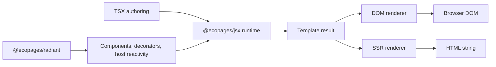
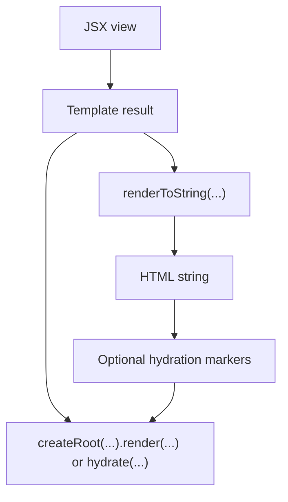
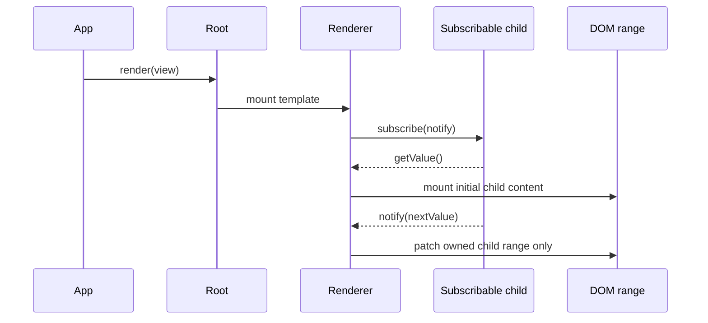

# Radiant JSX

Radiant JSX is the JSX authoring layer for the Radiant ecosystem.

Use `@ecopages/jsx` when you want TSX syntax, intrinsic element typing, SSR serialization, hydration support, and direct DOM mounting. Keep using `@ecopages/radiant` when you need component classes, decorators, lifecycle, and reactive host state.

[](https://www.npmjs.com/package/@ecopages/jsx)
[](https://github.com/radiant/radiant/blob/main/LICENSE)

## Start Here

The shortest accurate mental model is:

1. JSX produces a renderer-neutral template result.
2. The same template result can go to the DOM renderer or the SSR renderer.
3. Fine-grained updates happen at bound child ranges, not through a hook scheduler.

## What This Package Does

`@ecopages/jsx` provides:

- automatic JSX runtime entry points through `@ecopages/jsx/jsx-runtime` and `@ecopages/jsx/jsx-dev-runtime`
- typed intrinsic HTML and SVG elements
- plain function components and fragments
- primary DOM event bindings with `on:*`
- explicit native escape-hatch bindings with `on-native:*`
- explicit property bindings with `prop:*`
- boolean, `data`, `aria`, `class`, `className`, `classes`, and `style` normalization
- direct DOM mounting with `createRoot(...)`
- HTML string rendering with `renderToString(...)`
- hydration markers and DOM hydration helpers
- direct signal-like child bindings through `get()` and `subscribe(...)`
- subscribable child bindings through `createSubscribableJsxValue(...)`

Use `@ecopages/jsx/server` for server-only helpers such as `renderToString(...)` and server custom-element render hooks.

`@ecopages/jsx` does not provide component state, hooks, decorators, or a standalone component model. Those stay in `@ecopages/radiant`.

Signal-like values that expose `get()` and `subscribe(...)` can be passed directly as child bindings. `createSubscribableJsxValue(...)` remains useful when an external source does not already speak that shape but still needs fine-grained child updates.

## Package Boundary

This is the simplest way to place `@ecopages/jsx` inside the larger system.



Read it like this:

- `@ecopages/jsx` owns TSX syntax, template creation, DOM mounting, hydration, and SSR serialization.
- `@ecopages/radiant` owns component behavior and decides when a component should render.
- Both DOM and SSR flows consume the same template result shape.

## Install And Configure

Install both packages:

```bash
npm install @ecopages/radiant @ecopages/jsx
```

Minimum TypeScript setup:

```json
{
	"compilerOptions": {
		"jsx": "react-jsx",
		"jsxImportSource": "@ecopages/jsx"
	}
}
```

Or enable it per file:

```tsx
/** @jsxImportSource @ecopages/jsx */
```

## Quick Start With Radiant

The most common path is a `RadiantElement` that returns JSX from `render()`.

```tsx
/** @jsxImportSource @ecopages/jsx */
import { RadiantElement, customElement, prop } from '@ecopages/radiant';

const CounterButton = ({ label, onPress }: { label: string; onPress: (event: MouseEvent) => void }) => (
	<button type="button" on:click={onPress} aria={{ label }}>
		{label}
	</button>
);

@customElement('radiant-counter')
export class RadiantCounter extends RadiantElement {
	@prop({ type: Number, reflect: true, defaultValue: 0 }) count!: number;

	private readonly increment = () => {
		this.count += 1;
	};

	private readonly decrement = () => {
		this.count -= 1;
	};

	override render() {
		return (
			<section class="counter" data={{ state: this.count > 0 ? 'active' : 'idle' }}>
				<h2>Count: {this.count}</h2>
				<div class="controls">
					<CounterButton label="Decrement" onPress={this.decrement} />
					<CounterButton label="Increment" onPress={this.increment} />
				</div>
			</section>
		);
	}
}
```

## Rendering Pipeline

There is one authoring output and two rendering targets.



This is the key simplification:

- JSX authoring is shared.
- DOM rendering and SSR are different consumers of the same structure.
- Hydration is not a second authoring mode. It is an SSR output mode plus a client attach step.

## Direct DOM Usage

If you need app-level mounting outside a `RadiantElement`, use the DOM root helper.

```tsx
/** @jsxImportSource @ecopages/jsx */
import { createRoot } from '@ecopages/jsx';

function DirectHandlers() {
	function handleClick() {
		console.log('Click');
	}

	const handleInput = (event: Event) => {
		console.log((event.currentTarget as HTMLInputElement).value);
	};

	return (
		<>
			<button on:click={handleClick}>Log click</button>
			<button on-native:click={handleClick}>Always native click</button>
			<input on:input={handleInput} />
		</>
	);
}

const container = document.querySelector('#app');

if (container instanceof HTMLElement) {
	const root = createRoot(container);
	root.render(<DirectHandlers />);
}
```

## Event Handling

Browser events are simpler than they first look. Something happens, the browser creates an `Event` object, and that event starts on the node where the interaction actually occurred. That original node is `event.target`.

From there, the event may travel through the DOM tree. Most UI events you care about, like `click`, `input`, and `keydown`, bubble upward. When a handler runs, `event.currentTarget` is the element whose listener is currently executing. That difference matters: `target` answers "where did this start?" and `currentTarget` answers "which listener is running right now?"

Event delegation is just using that travel on purpose. Instead of attaching one listener to every matching element, you attach fewer listeners higher in the tree and react based on where the event started. That is often a good trade for repeated interactive UI such as lists, tables, menus, and boards. The catch is that delegation only works for events that bubble, and it changes where the real DOM listener lives.

Radiant keeps those choices explicit instead of hiding them behind a synthetic event system.

| Use this      | When you want                                                   | Runtime shape                                                                                       |
| ------------- | --------------------------------------------------------------- | --------------------------------------------------------------------------------------------------- |
| `on:*`        | The normal event API                                            | Radiant delegates a fixed allowlist of bubbling events and falls back to direct listeners otherwise |
| `on-native:*` | Exact element-level browser semantics even for delegated events | Radiant calls `addEventListener(...)` on the element itself                                         |

`on:*` is the default. For the delegated allowlist, Radiant attaches one listener per event type on the render root and dispatches to matched elements. For everything else, `on:*` attaches directly on the element. In both cases the handler receives the native browser event object.

The delegated allowlist is fixed and documented: `beforeinput`, `click`, `contextmenu`, `dblclick`, `focusin`, `focusout`, `input`, `keydown`, `keyup`, `mousedown`, `mouseout`, `mouseover`, `mouseup`, `pointerdown`, `pointerout`, `pointerover`, `pointerup`, `touchend`, `touchmove`, and `touchstart`.

Use `on-native:*` when exact element-level attachment semantics matter, such as when an ancestor stops bubbling before the root listener runs or when you want to opt out of delegation for a supported bubbling event. Events outside the allowlist, such as `focus`, `blur`, `scroll`, `load`, `invalid`, or `dragstart`, already attach directly when authored with `on:*`.

## Fine-Grained Updates

The main non-obvious part of the package is that it already supports child-range subscriptions. A parent tree does not need to rerender when one bound child value changes.



Pass a signal-like child value directly when it already exposes `get()` and `subscribe(...)`. Use `createSubscribableJsxValue(...)` when a child value has its own update source but does not already match that shape.

```tsx
/** @jsxImportSource @ecopages/jsx */
import { createRoot, createSubscribableJsxValue } from '@ecopages/jsx';

let count = 0;
const subscribers = new Set<(value: number) => void>();

const boundCount = createSubscribableJsxValue({
	getValue: () => count,
	subscribe: (notify) => {
		subscribers.add(notify);

		return () => {
			subscribers.delete(notify);
		};
	},
});

const root = createRoot(document.querySelector('#app') as HTMLElement);
root.render(<p>Count: {boundCount}</p>);

count += 1;

for (const subscriber of subscribers) {
	subscriber(count);
}
```

That contract is intentionally small. The package does not impose a single state container. It just gives the renderer a stable subscription surface for either signal-like values or explicit subscribable wrappers.

## Empty Values And Removal

Most code should use normal JavaScript values for empty output and removal semantics.

Use this rule of thumb:

- `null`, `undefined`, and `false` render no child content
- `null` and `undefined` remove normal attributes
- `false` removes boolean attributes such as `hidden` or `disabled`
- `null` removes delegated and native event handlers by omitting the next listener
- `undefined` clears deferred property bindings by writing `undefined`

For child content:

```tsx
/** @jsxImportSource @ecopages/jsx */

const nextLabel = shouldShowLabel ? 'Ready' : null;

return <p>{nextLabel}</p>;
```

For attributes and bindings:

```tsx
/** @jsxImportSource @ecopages/jsx */

return (
	<button
		class={shouldResetClass ? null : 'toolbar-action'}
		hidden={isVisible ? false : true}
		on:click={isInteractive ? handleClick : null}
		prop:payload={hasPayload ? payload : undefined}
	/>
);
```

Important consequence: removing a binding by switching to `null`, `undefined`, or `false` follows normal template update semantics. If that changes the template shape, the renderer may replace the affected DOM node instead of preserving the previously committed instance.

## Dev Warnings

The runtime warnings are intentionally defensive around hydration markers and renderer-owned DOM anchors because those failures are otherwise silent and hard to debug.

They are already off in production by default. In development, you can force them on or off globally:

```ts
import { setDevWarningsEnabled } from '@ecopages/jsx/jsx-dev-runtime';

setDevWarningsEnabled(false);
setDevWarningsEnabled(true);
setDevWarningsEnabled(undefined);
```

Pass `undefined` to return to the default behavior, which is "on in development, off in production".

## SSR And Hydration

`renderToString(...)` now has two explicit output modes:

- `mode: 'plain'` emits plain HTML without hydration markers
- `mode: 'hydrate'` emits hydratable HTML with binding markers

```tsx
/** @jsxImportSource @ecopages/jsx */
import { renderToString } from '@ecopages/jsx/server';

const view = (
	<button class="action" hidden={false} aria={{ label: 'Ship order' }}>
		Ship
	</button>
);

const html = renderToString(view, { mode: 'plain' });
const hydratedHtml = renderToString(view, { mode: 'hydrate' });
```

Hydrated SSR adds binding markers so `hydrate(...)` can attach listeners and dynamic parts without rebuilding the existing DOM tree.

## Authoring Patterns

### Intrinsic Elements

```tsx
const view = (
	<section>
		<h2>Status</h2>
		<svg viewBox="0 0 24 24" aria={{ hidden: true }}>
			<circle cx="12" cy="12" r="10" />
		</svg>
	</section>
);
```

### Custom Elements

When `jsxImportSource` points at `@ecopages/jsx`, custom elements should augment the runtime module instead of the global `JSX` namespace.

```tsx
import type { JsxCustomElementAttributes } from '@ecopages/jsx';

type UserCardProps = {
	name: string;
	isAdmin: boolean;
};

declare module '@ecopages/jsx/jsx-runtime' {
	interface JsxCustomIntrinsicElements {
		'user-card': JsxCustomElementAttributes<HTMLElement, UserCardProps>;
	}
}
```

### Function Components And Fragments

```tsx
type CardProps = {
	title: string;
	children?: import('@ecopages/jsx').JsxRenderable;
};

const Card = ({ title, children }: CardProps) => (
	<>
		<article class="card">
			<h2>{title}</h2>
			{children}
		</article>
	</>
);
```

### Event Bindings

```tsx
<button on:click={this.handleClick}>Save</button>
<button on-native:click={this.handleNativeClick}>Save with native attachment</button>
```

`on:*` is the normal event API. Radiant automatically delegates compatible bubbling events for efficiency and attaches directly for everything else. `on-native:*` is the escape hatch when the handler must behave exactly like a browser listener attached on that element. Neither mode wraps the browser event in a React-style synthetic object.

### Property Bindings

```tsx
<custom-editor prop:value={draft} prop:config={editorConfig} />
```

Use `prop:*` when the target must receive a real property value instead of a serialized attribute.

### Structured `data`, `aria`, `class`, and `style`

```tsx
<section
	class={['panel', isActive && 'panel--active']}
	classes={['surface', { interactive: true }]}
	style={{ backgroundColor: 'white', fontSize: '14px' }}
	data={{ tid: 'panel', state: 'ready' }}
	aria={{ live: 'polite' }}
/>
```

## Runtime Output Contract

`jsx()` and `jsxs()` return a template result object that contains:

- `jsx()` is emitted when JSX produces one logical child value
- `jsxs()` is emitted when JSX produces multiple sibling child values

- static string segments
- dynamic values
- a stable marker used by the Radiant renderers to recognize the object shape

That distinction is not cosmetic. It preserves child-slot structure from the automatic JSX transform.

```tsx
const single = <div>{items.map(renderItem)}</div>;
const siblings = (
	<div>
		<span>A</span>
		<span>B</span>
	</div>
);
```

The first case compiles to `jsx(...)` because the `div` has one logical child expression. Radiant keeps that iterable child grouped as one binding.

The second case compiles to `jsxs(...)` because the `div` has multiple sibling children. Radiant expands those siblings into separate positional template slots.

Why keep both instead of one export:

- TypeScript's automatic JSX runtime emits both names, so removing one would break the compiler contract.
- Radiant uses the distinction to decide whether `children` should stay as one grouped value or be split into sibling slots.
- Guessing later inside one function would lose source-level intent and make the template `strings` and `values` shape less predictable.

That object is an internal contract between the JSX runtime and the Radiant renderers. It is not positioned as a generic third-party virtual DOM format.

## Trusted Markup

`@ecopages/jsx` escapes normal text and attribute values by default.

If you already have final, trusted HTML and need to hand it to the runtime as markup, use `unsafeHtml(...)`.

```tsx
import { unsafeHtml } from '@ecopages/jsx';

const trustedSnippet = unsafeHtml('<strong>Trusted</strong>');

const view = <p>{trustedSnippet}</p>;
```

Important:

- this is an unsafe opt-in escape hatch
- the input is not sanitized
- the input is not escaped again
- untrusted user input must not flow through this helper

The runtime treats trusted markup as opaque HTML content. It is inserted as markup for DOM mounting and emitted as-is during SSR, but it does not become a live JSX template or a hydratable binding boundary.

## Exported Surface

Main exports:

- `Fragment`
- `unsafeHtml`
- `jsx`
- `jsxs`
- `createRoot`
- `render`
- `hydrate`
- `hasHydrationMarkers`
- `renderToString`
- `createSubscribableJsxValue`
- `isKeyedJsxValue`
- `isSubscribableJsxValue`

Key types:

- `JsxComponent`
- `JsxFragment`
- `JsxIntrinsicAttributes`
- `JsxNodeLike`
- `JsxPrimitive`
- `JsxPropsWithChildren`
- `JsxRenderable`
- `JsxRoot`
- `RenderToStringOptions`
- `SubscribableJsxValue`
- `TemplateResultLike`

The automatic development runtime also exports `jsxDEV` from `@ecopages/jsx/jsx-dev-runtime`.

## Constraints

- This package is intentionally smaller than React-like frameworks. There is no hook system or component-local scheduler here.
- `@ecopages/jsx` handles authoring and rendering primitives. `@ecopages/radiant` handles component lifecycle and host reactivity.
- Use `renderToString(...)` and `createRoot(...)` directly when you need lower-level control outside a Radiant host.

## Why Use It

Use `@ecopages/jsx` if you want to:

- author Radiant components with TSX instead of string templates
- compose plain function components inside custom-element views
- keep bindings explicit and native instead of hiding them behind a synthetic event layer
- share one JSX authoring model across DOM rendering and SSR
- opt into fine-grained child updates without adopting a hook runtime
