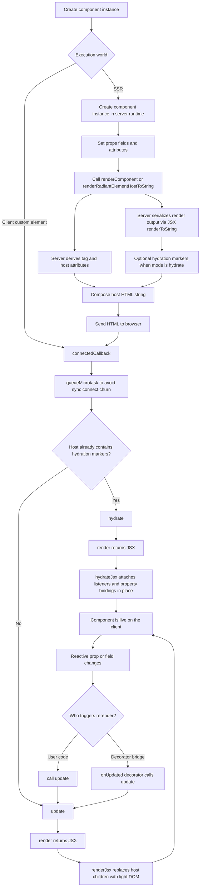

# Radiant Core

Reflected properties serialize the current member state on each write. A synchronous callback (`@bindTo`, `registerUpdateCallback`) that normalizes an assignment is reflected too. `@onUpdated` does not run at that moment; it waits for the update cycle.

## RadiantElement Flow

`RadiantElement` is the JSX-first custom-element base for explicit client rendering and opt-in hydration. Host HTML serialization belongs to the **server pipeline** (`@ecopages/radiant/server/*`), not to instance methods on the element.

Its main responsibilities are:

- `connectedCallback()` decides whether first connect should hydrate or do a fresh client render.
- `update()` is the explicit rerender entrypoint.
- `hydrate()` is the explicit SSR-to-client entrypoint.
- `renderViewToString()` is the narrow host hook that asks the installed server runtime to serialize the JSX view (requires a server SSR entry import).



## Client Flow

Client rendering works like this:

1. The browser upgrades the custom element and calls `connectedCallback()`.
2. `RadiantElement` waits one microtask, then `completeInitialSync()` adopts authored attributes and reflects the values the host actually holds. A property assigned before upgrade, or through its accessor before that sync, wins over the authored attribute.
3. If the host already contains hydration markers and the explicit client hydrator is installed, `hydrate()` attaches behavior to that DOM in place.
4. Otherwise `update()` renders fresh light DOM into the host.
5. Later state changes do nothing automatically unless user code calls `update()` directly or a decorator such as `@onUpdated(...)` calls it.

Writes in the same turn share one update cycle. `@onUpdated` runs once for the members it watches, a pending render commits, then `updated(changed)` runs. `await updateComplete` waits for that cycle, including the first connect render.

Hosts observe their members only while connected, snapshotting values on disconnect and reporting what changed on the next connect. Automatic updates run for connected hosts in any DOM. Server rendering never connects hosts: it observes members only while preparing a host, drains pending `@onUpdated` callbacks, and never calls `updated()`. A cycle that throws drops its changes and rejects `updateComplete`.

Decorators and SSR adapters reach host plumbing (post-sync and batched callback registration, the SSR provider and hydration registry, initial update emits) through the `REACTIVE_HOST` symbol, not through public host methods.

`render()` describes the view. `update()` runs the cycle that commits it into the host.

## SSR Flow

SSR works like this:

1. Server code creates the component instance (typically via `renderComponent(...)`).
2. Server code sets props, fields, or attributes exactly as client code would.
3. When authored light DOM is needed, a server render environment prepares the host before rendering.
4. Prefer `@ecopages/radiant/server/render-component` for adapters and fragment responses.
5. The JSX server renderer turns `render()` output into HTML.
6. When hydration is requested, hydration markers are emitted into the rendered view.
7. The browser receives `<my-element ...>...</my-element>` markup.
8. On first connect, the same component instance logic decides whether to hydrate or do a fresh render.

Radiant renders into the host's light DOM only, on the client and on the server.

`renderRadiantElementViewToString(...)` / `renderViewToString()` serialize only the component view.
`renderRadiantElementHostToString(...)` from `@ecopages/radiant/server/radiant-element-ssr` / `renderComponent(...)` serialize the full custom-element host together with the view.
When slot-aware SSR needs authored light DOM, adapters prepare the host through `prepareHost` / `authoredContent` on `renderComponent`.

## Public API

- `render()` returns the current JSX tree.
- `update()` runs the update cycle now and rerenders the host from the current JSX tree when `render()` is overridden.
- `hydrate()` hydrates SSR markup already present in the host.
- `renderViewToString()` asks the installed server runtime to serialize the view (server entry must be imported first).

Host attribute serialization and full host HTML composition live in the server pipeline. They are not Element Host instance APIs.

For first-connect hydration on SSR pages, install the explicit client hydrator before loading component modules:

```ts
import '@ecopages/radiant/client/install-hydrator';
```

## Host Attributes

By default, server host serialization includes:

- reflected reactive properties from `getReactiveProperties()`
- reactive property metadata registered through `@prop(...)`
- attributes already present on the element instance

Reactive prop metadata is stored per constructor. Subclass `@prop` registrations copy inherited definitions before writing, so sibling and parent classes keep class-specific registries and SSR host attributes.

See [../server/README.md](../server/README.md) for adapter-facing SSR helpers.
