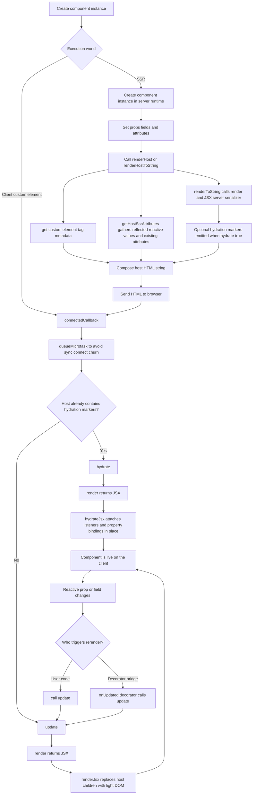

# Radiant Core

## RadiantComponent Flow

`RadiantComponent` is the JSX-first base class for explicit client rendering, SSR host serialization, and hydration.

Its main responsibilities are:

- `connectedCallback()` decides whether first connect should hydrate or do a fresh client render.
- `update()` is the explicit rerender entrypoint.
- `hydrate()` is the explicit SSR-to-client entrypoint.
- `renderHost()` and `renderHostToString()` serialize the custom-element host together with the current JSX view.

## Client Flow

Client rendering works like this:

1. The browser upgrades the custom element and calls `connectedCallback()`.
2. `RadiantComponent` waits one microtask before doing any work.
3. If the host already contains hydration markers, `hydrate()` attaches behavior to that DOM in place.
4. Otherwise `update()` renders fresh light DOM into the host.
5. Later state changes do nothing automatically unless user code calls `update()` directly or a decorator such as `@onUpdated(...)` calls it.

`render()` describes the view. `update()` is the method that commits it into the host.

## SSR Flow

SSR works like this:

1. Server code creates the component instance.
2. Server code sets props, fields, or attributes exactly as client code would.
3. `renderHost()` or `renderHostToString()` resolves the host tag name, gathers host attributes, and renders the current JSX view.
4. The JSX server renderer turns `render()` output into HTML.
5. When hydration is requested, hydration markers are emitted into the rendered view.
6. The browser receives `<my-element ...>...</my-element>` markup.
7. On first connect, the same component instance logic decides whether to hydrate or do a fresh render.

`renderToString({ hydrate: true })` serializes only the component view with hydration markers.
`renderHostToString({ hydrate: true })` serializes the full custom-element host together with the component view.

## Public API

- `render()` returns the current JSX tree.
- `update()` rerenders the host using the current JSX tree.
- `hydrate()` hydrates SSR markup already present in the host.
- `renderToString()` serializes the component view without the custom-element host.
- `renderHost()` returns a host-aware JSX node-like value.
- `renderHostToString()` serializes the custom-element host and current view into HTML.
- `getHostSsrAttributes()` returns the attributes that should be included on the serialized host.

## Host Attributes

By default, host serialization includes:

- reflected reactive properties from `getReactiveProperties()`
- reactive prop metadata registered through `@reactiveProp(...)`, `@prop(...)`, or `@jsxProp(...)`
- attributes already present on the element instance

Subclasses can override `getHostSsrAttributes()` when they need custom host serialization.

The lower-level host serialization logic is handled internally and is not part of the public API.
